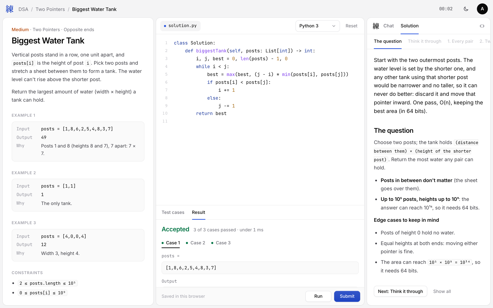
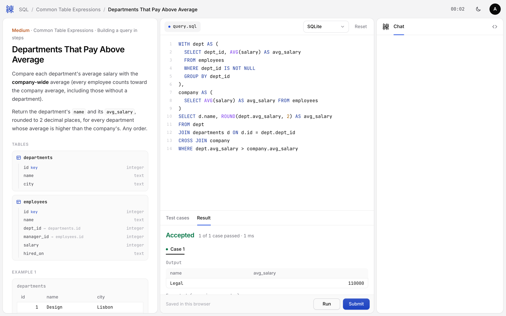

# Ren

Interview prep that feels real. Ren is a web app for getting ready for software engineering interviews, built around three parts:

1. **Practice**: DSA, SQL and system design problems, with lessons that teach each pattern before you solve its problems.
2. **Resume**: a resume checker and a LaTeX resume builder.
3. **Interview**: a live mock interview that feels like talking to a person.

Practice is the part that's built today. Resume and Interview have landing pages and are next.

<p align="center">
  
  
</p>

---

## Contents

- [What's built](#whats-built)
- [Tech stack](#tech-stack)
- [Running it locally](#running-it-locally)
- [Running code locally](#running-code-locally)
- [Deploying to Vercel](#deploying-to-vercel)
- [Project structure](#project-structure)
- [API](#api)
- [Content tools](#content-tools)
- [Content rules](#content-rules)
- [Roadmap](#roadmap)

---

## What's built

### Pages

| Page | File | What it does |
|---|---|---|
| Landing | `design/index.html` | The marketing page, with one product window for each part of Ren |
| Sign up / Log in | `design/signup.html`, `design/login.html` | Email and password accounts (the Google button is a placeholder) |
| Home | `design/app.html` | The signed-in home page |
| Practice | `design/practice.html` | Pick a track: DSA, SQL or system design |
| DSA sheet | `design/dsa.html` | Every topic → pattern → problem, with search, track tabs and Difficulty / Type / Status filters. Problems that aren't written yet show as locked |
| Pattern lesson | `design/learn.html?id=<pattern>` | A full lesson on one pattern, to read before its problems |
| DSA problem | `design/problem.html?id=<problem>` | Statement, code editor and console, Run / Submit, and a written solution behind a spoiler warning |
| SQL sheet | `design/sql.html` | The SQL bank, grouped by topic and pattern |
| SQL problem | `design/sql-problem.html?id=<problem>` | Statement, tables, query editor, Run / Submit |
| 404 | `design/404.html` | Shown for any page that doesn't exist |

Light and dark themes are both supported, with a toggle.

### Content

| | Written | Notes |
|---|---|---|
| DSA problems | **381 of 657** | 23 topics, 181 patterns. All of Foundations is written, plus most of Core |
| DSA solutions | **220** | Step-by-step explanations: traces, invariants, proofs and common mistakes. Arrays & Hashing through Binary Search |
| Pattern lessons | **33** | Arrays & Hashing (15), Strings (7), Two Pointers (6), Sorting (5) |
| SQL problems | **176** | 18 topics, from Selecting & Filtering to Window Functions, Gaps & Islands and JSON data, including UPDATE / DELETE / INSERT problems |

Every DSA problem runs in **Python, Java and C++**, and in **C** when it's a plain function (C has no classes). SQL runs on **SQLite**.

---

## Tech stack

There's no framework and no build step.

- **Frontend:** plain HTML, CSS and JavaScript in `design/`. Fonts come from Google Fonts.
- **Server:** `server.js`, a single Node.js file using only built-in modules plus [`yaml`](https://www.npmjs.com/package/yaml). It serves the pages and a small JSON API.
- **Auth:** passwords are hashed with scrypt. The session is an HMAC-signed, HttpOnly, SameSite=Lax cookie (`ren_session`) that lasts 7 days.
- **DSA judge:** `backend/practice/dsa/tools/judge.mjs` runs submissions with local toolchains (`python3`, `javac`/`java`, `clang++`, `clang`) and compares answers.
- **SQL judge:** `backend/practice/sql/tools/judge.mjs` runs each query in a child process against a fresh in-memory database using Node's built-in `node:sqlite`. An authorizer stops anything except reads (and row writes for change problems).
- **Content pipeline:** Node and Python scripts that check every problem, its tests and its reference solution before it's published.

---

## Running it locally

### What you need

- **Node.js 22.13 or newer** (the SQL judge uses `node:sqlite`)
- **Python 3**, only for running Python code and the content scripts

### Setup

```sh
git clone https://github.com/thisisaadi123/Ren.git
cd Ren
npm install
cp .env.example .env
```

Fill in `.env`:

| Variable | What it's for |
|---|---|
| `PORT` | Port for the server (default `3000`) |
| `SESSION_SECRET` | Signs the session cookie. Generate one with `node -e "console.log(require('crypto').randomBytes(32).toString('hex'))"` |
| `SEED_EMAIL`, `SEED_PASSWORD`, `SEED_NAME` | A test account, recreated every time the server starts |

`.env` is gitignored, so it's never committed.

### Start the server

```sh
npm start      # http://localhost:3000
npm run dev    # the same, restarting when server.js changes
```

Log in with the seed account from `.env`, or sign up for a new one.

> **Accounts are kept in memory only.** Nothing is written to disk. Every account except the seed user is gone when the server stops. That's on purpose for now, until a database is chosen.

> Opening the HTML files directly, or through a plain static server, won't work: the pages need the API. Use `npm start`.

---

## Running code locally

**Run** and **Submit** execute the code people type, so the server only allows them for requests from the same machine, and only one run per account at a time.

- **Python** needs `python3`.
- **Java** needs a JDK (`javac` and `java`).
- **C++ / C** need `clang++` / `clang`.

Languages whose toolchain is missing show as unavailable in the editor.

**Submit** checks against every test, hidden ones included. Generated tests and their expected answers live in `backend/practice/dsa/build/`, which is gitignored (about 500 MB). Build it once after cloning:

```sh
npm run check:dsa -- --write-expected --jobs 6 --quiet
```

Without it, the judge only uses the hand-written tests in each problem's `tests.json`.

SQL needs nothing extra: its expected answers are committed.

---

## Deploying to Vercel

The repo is ready for Vercel as it is. `vercel.json` sends every request to `server.js`, which exports the same request handler `npm start` uses. Pages, auth redirects, the 404 page and the API all behave the same as they do locally.

### Steps

1. Push to GitHub.
2. In Vercel, choose **Add New → Project** and import the `Ren` repository.
3. Keep the defaults: Framework Preset **Other**, no build command, no output directory. `vercel.json` handles the rest.
4. Under **Environment Variables**, add:

   | Name | Value |
   |---|---|
   | `SESSION_SECRET` | A long random string (see the command above). **Required**: without it every server instance makes its own secret, and people get logged out at random |
   | `SEED_EMAIL` | The demo account's email |
   | `SEED_PASSWORD` | The demo account's password |
   | `SEED_NAME` | The demo account's display name |

   `PORT` isn't needed on Vercel.

5. Click **Deploy**.

The Node.js version comes from `engines` in `package.json` (22.13 or newer).

### What works on the hosted site

| Feature | Hosted on Vercel |
|---|---|
| Landing page, sign up, log in, log out | Yes |
| Home, Practice, DSA sheet, SQL sheet | Yes |
| Pattern lessons and written solutions | Yes |
| Problem statements, examples, starter code | Yes |
| **Run / Submit (DSA and SQL)** | **No.** Turned off on purpose, see below |
| Seed account | Yes. It works on every server instance |
| Accounts from sign up | Only until that server instance shuts down |

**Why Run and Submit are off:** they execute whatever code is typed in. Vercel's runtime passes requests to the function over localhost, so the "same machine only" check would let anyone on the internet run code on the server. When `server.js` sees the `VERCEL` environment variable, Run and Submit answer *"Running code isn't available on the hosted site yet."* Turning them on needs a proper sandboxed runner (see [Roadmap](#roadmap)).

**Why sign ups don't last:** accounts are stored in memory. Vercel starts and stops server instances as traffic changes, and each one has its own memory. Use the seed account for demos until there's a database.

### Deploying from the CLI

```sh
npm i -g vercel
vercel          # preview deployment
vercel --prod   # production
```

`.vercelignore` keeps `.env`, `node_modules/` and the 500 MB `build/` folder out of CLI uploads.

---

## Project structure

```
Ren/
├── server.js                 # Dev server + API; also the Vercel function
├── vercel.json               # Sends every request on Vercel to server.js
├── package.json
├── .env.example              # Copy to .env
│
├── design/                   # The frontend: every page, style and script
│   ├── index.html            # Landing page
│   ├── login.html  signup.html
│   ├── app.html              # Signed-in home
│   ├── practice.html         # Track picker
│   ├── dsa.html  dsa.js      # DSA sheet
│   ├── learn.html  learn.js  # Pattern lessons
│   ├── problem.html  problem.js     # DSA workspace
│   ├── solution.js  visual.js       # Written solutions and their drawings
│   ├── sql.html  sql-problem.html   # SQL sheet and workspace
│   ├── session.js            # Shared signed-in shell (navbar, auth check, loader)
│   ├── api.js                # fetch wrapper for the API
│   ├── loader.js             # Loading screen
│   ├── styles.css            # Shared tokens, light and dark themes
│   ├── previews/             # Product screenshots used on the home and practice pages
│   └── 404.html
│
└── backend/practice/
    ├── dsa/
    │   ├── taxonomy.yaml     # Topics → patterns → planned counts (the source of truth)
    │   ├── problems/<topic>/<pattern>/<id>/
    │   │   ├── problem.yaml  # Metadata and function signature
    │   │   ├── statement.md
    │   │   ├── tests.json
    │   │   ├── solution.json # Written-out solution (when there is one)
    │   │   └── ...           # Reference solutions, generators, validators
    │   ├── lessons/<topic>/<pattern>.json   # Built pattern lessons
    │   ├── tools/            # Checker, judge, language runners, lesson builder
    │   ├── build/            # Generated tests (gitignored)
    │   └── README.md         # How the DSA bank works
    └── sql/
        ├── taxonomy.yaml
        ├── problems/<topic>/<pattern>/<id>/
        │   ├── problem.json  # Statement, tables, reference query, wrong queries
        │   └── tests.json    # Example and hidden datasets
        ├── tools/            # Engine, judge, checker, problem authoring
        └── README.md         # How the SQL bank works
```

Each bank has its own README with the details: [DSA](backend/practice/dsa/README.md) · [SQL](backend/practice/sql/README.md).

---

## API

Every endpoint returns JSON. POST bodies must be JSON (`Content-Type: application/json`). Everything except sign up, log in and log out needs a session, and answers `401` without one.

| Method | Path | Body / query | Returns |
|---|---|---|---|
| `POST` | `/api/signup` | `{ email, password }` | `201 { user }` and signs you in |
| `POST` | `/api/login` | `{ email, password }` | `200 { user }` |
| `POST` | `/api/logout` | | `204` |
| `GET` | `/api/me` | | `200 { user }` |
| `GET` | `/api/dsa` | | The whole DSA sheet: tracks, topics, patterns, problems |
| `GET` | `/api/dsa/problem` | `?id=` | One problem for the workspace |
| `GET` | `/api/dsa/solution` | `?id=` | The written-out solution |
| `GET` | `/api/dsa/lesson` | `?id=<pattern>` | The pattern's lesson, its problems, and the lessons before and after |
| `POST` | `/api/dsa/run` | `{ id, lang, code, cases }` | Results on the visible or custom cases |
| `POST` | `/api/dsa/submit` | `{ id, lang, code }` | `{ verdict, passed, total }` |
| `GET` | `/api/sql` | | The whole SQL sheet |
| `GET` | `/api/sql/problem` | `?id=` | One SQL problem |
| `POST` | `/api/sql/run` | `{ id, code }` | Results on the example datasets |
| `POST` | `/api/sql/submit` | `{ id, code }` | `{ verdict, passed, total }` |

Signed-in pages (`app`, `practice`, `dsa`, `learn`, `problem`, `sql`, `sql-problem`) redirect to log in when there's no session. Log in and sign up redirect to home when there is one.

---

## Content tools

| Command | What it does |
|---|---|
| `npm run check:dsa` | Checks every DSA problem: schema, tests, reference solutions in all four languages, and bank-wide rules |
| `npm run check:dsa -- <problem-dir>` | Checks one problem |
| `npm run check:dsa -- --write-expected` | Fills in missing expected answers from the reference solution |
| `npm run test:dsa` | Self-test: plants known bugs and confirms the checker catches each one |
| `npm run check:solutions` | Runs every approach in every written solution against the problem's tests |
| `npm run lessons` | Builds the pattern lessons and runs their code in every language |
| `npm run check:sql` | Checks every SQL problem: the reference runs, every wrong query fails, there are enough hidden tests |

---

## Content rules

- **Every problem is original.** Statements, examples, constraints and tests are written for Ren. Classic ideas are fine in our own words; wording from LeetCode, GeeksforGeeks, HackerRank or any other site is not.
- **No implied partnerships.** No "LeetCode #1011". Plain "similar problem" links are fine.
- **Depth over count.** A solution walks through traces, invariants, proofs and common mistakes, not just the code.
- **Checked before it ships.** A problem is published only after the checker passes in every language.

---

## Roadmap

- [ ] A database for accounts and progress (accounts are in memory for now)
- [ ] A sandboxed code runner, so Run and Submit work on the hosted site
- [ ] Google sign in and password reset emails
- [ ] The rest of the DSA bank (276 problems), solutions from Linked List onward, and more pattern lessons
- [ ] System design practice
- [ ] Resume checker and LaTeX resume builder
- [ ] Live mock interviews
